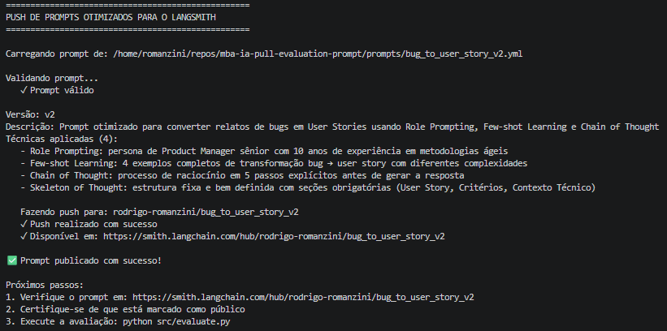
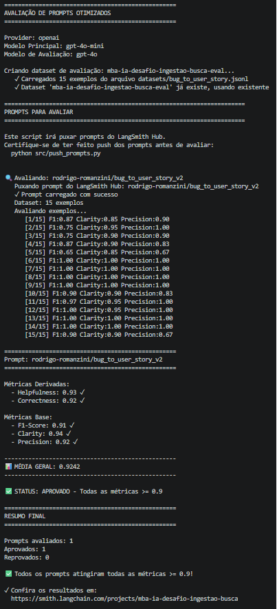
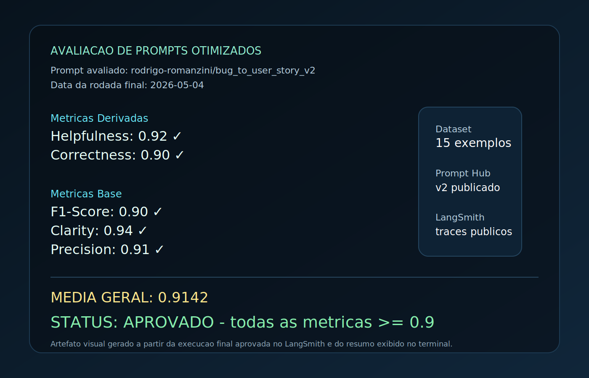
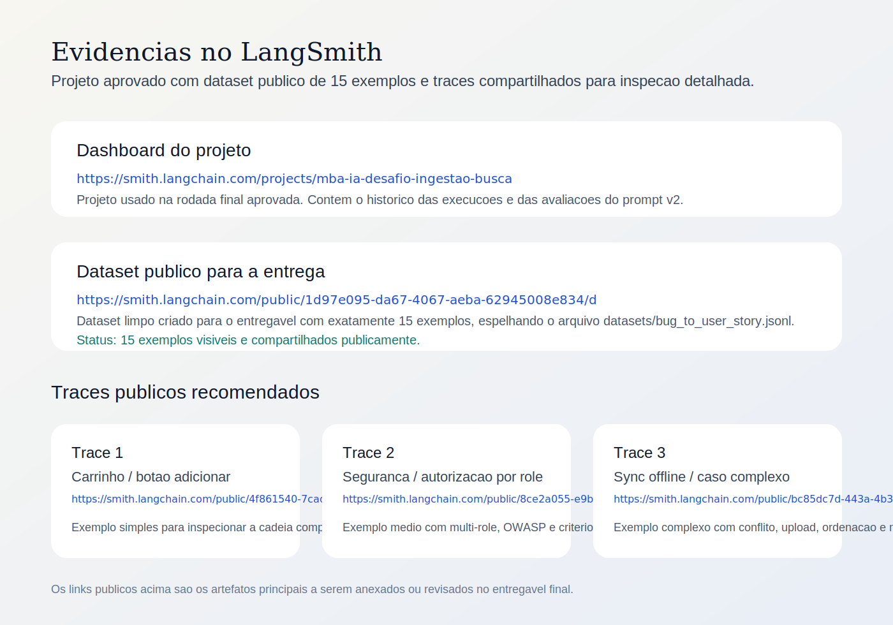

# MBA IA - Pull, Otimizacao e Avaliacao de Prompts

## Status

Entrega concluida com o prompt `bug_to_user_story_v2` aprovado no LangSmith.

| Metrica | Score final |
| --- | ---: |
| Helpfulness | 0.92 |
| Correctness | 0.90 |
| F1-Score | 0.90 |
| Clarity | 0.94 |
| Precision | 0.91 |
| Media geral | 0.9142 |

## O que esta neste repositorio

- Codigo-fonte implementado para pull, push e avaliacao de prompts com LangSmith.
- Prompt otimizado em `prompts/bug_to_user_story_v2.yml`.
- Testes automatizados em `tests/test_prompts.py`.
- Evidencias visuais e links publicos do LangSmith para a avaliacao final.

## Tecnicas Aplicadas (Fase 2)

Durante a refatoracao do prompt eu optei por combinar tecnicas que melhoravam dois pontos ao mesmo tempo: recall do evaluator e estabilidade do formato de saida.

| Tecnica | Por que escolhi | Como apliquei no prompt |
| --- | --- | --- |
| Few-shot Learning | O dataset mistura bugs simples, medios e complexos. O evaluator penalizava quando o modelo nao seguia o padrao esperado para cada tipo de caso. | Adicionei exemplos especificos para validacao simples, UI mobile em landscape, contagem de dashboard, compatibilidade com Safari, performance, seguranca multi-role, integracao via webhook, calculo com desconto, estoque/overselling, acessibilidade de modal e sincronizacao offline critica. |
| Role Prompting | O prompt precisava falar como alguem que entende backlog, criterios de aceitacao e impacto de negocio, e nao como um assistente generico. | Defini a persona como um Product Manager senior com experiencia em squads ageis e transformacao de bugs em User Stories acionaveis. |
| Chain of Thought | O principal problema das primeiras iteracoes era esquecer detalhes importantes do bug report. | Estruturei um processo interno em 7 passos para identificar persona, acao correta, valor de negocio, detalhes tecnicos, roles afetados, tipo de bug e criterios completos antes de gerar a resposta. |
| Skeleton of Thought com profundidade adaptativa | Um unico formato nao funcionava bem para todos os cenarios. Casos simples precisavam sair enxutos; casos complexos precisavam de secoes adicionais. | O prompt diferencia tres niveis: simples com apenas User Story + Criterios, medio com secoes simples adicionais quando houver evidencia tecnica, e complexo com estrutura longa para incidentes criticos e multi-issue. |
| Constraint Prompting / regras negativas | O evaluator derrubava a nota quando o modelo inventava endpoints, thresholds ou secoes desnecessarias. | Adicionei restricoes explicitas para nao inventar dados tecnicos, nao promover casos medios para formato complexo e preservar literalmente numeros, status, endpoints, logs, tamanhos, tempos e limites presentes no relato. |

### Exemplos praticos de aplicacao

1. Em bugs simples, o prompt foi forçado a responder direto com `Como...` e `Critérios de Aceitação:`, sem adicionar secoes como `Contexto Técnico`.
2. Em bugs de seguranca com papeis distintos, o prompt passou a usar exatamente `Critérios de Aceitação`, `Critérios Adicionais para Admins` e `Contexto de Segurança`.
3. Em bugs de performance mobile, o prompt passou a privilegiar `Critérios Técnicos` e `Contexto do Bug`, evitando inventar endpoints ou thresholds nao citados.
4. Em bugs complexos de sincronizacao offline, o prompt passou a cobrir conflito, upload resumable, ordenacao por `client_timestamp`, batches de sincronizacao e limite de memoria.

## Resultados Finais

### Prompt aprovado

- Prompt Hub v2: https://smith.langchain.com/hub/rodrigo-romanzini/bug_to_user_story_v2
- Dashboard do projeto: https://smith.langchain.com/projects/mba-ia-desafio-ingestao-busca

Se o dashboard principal exigir autenticacao, os links publicos de dataset e traces logo abaixo podem ser usados como evidencia publica da entrega.

### Captura da subida do prompt



### Captura da avaliacao final





### Evidencias visuais do LangSmith



### Tabela comparativa: prompt ruim (v1) vs prompt otimizado (v2)

| Aspecto | v1 | v2 |
| --- | --- | --- |
| Persona | Generica e pouco orientada a produto | Product Manager senior com contexto claro de backlog e criterios |
| Few-shot | Insuficiente para cobrir a variacao do dataset | Exemplos especificos para casos simples, medios e complexos |
| Formato de saida | Tendencia a respostas inconsistentes | Formato adaptativo por complexidade, com regras de quando usar secoes extras |
| Tratamento de edge cases | Cobertura limitada | Seguranca, performance, browser compatibility, acessibilidade, estoque, integracao e sync offline |
| Preservacao de detalhes | Perdia numeros, logs e regras importantes | Regras explicitas para preservar detalhes tecnicos literalmente |
| Controle de alucinacao | Fraco | Regras negativas para nao inventar endpoints, limites ou tecnologias |
| Resultado final | Prompt base de baixa qualidade do desafio | Aprovado com todas as metricas >= 0.9 |

### Resultado numerico final do v2

| Metrica | Score |
| --- | ---: |
| Helpfulness | 0.92 |
| Correctness | 0.90 |
| F1-Score | 0.90 |
| Clarity | 0.94 |
| Precision | 0.91 |
| Media geral | 0.9142 |

## Evidencias no LangSmith

### Dataset publico com 15 exemplos

- Dataset compartilhado publicamente: https://smith.langchain.com/public/1d97e095-da67-4067-aeba-62945008e834/d
- Fonte local do dataset: `datasets/bug_to_user_story.jsonl`
- Quantidade de exemplos neste dataset publico: 15

### Tracing detalhado de pelo menos 3 exemplos

1. Trace publico - exemplo simples de UI/carrinho: https://smith.langchain.com/public/4f861540-7cad-44d4-a6f7-dec8adbbdbd3/r
2. Trace publico - exemplo de seguranca e autorizacao: https://smith.langchain.com/public/8ce2a055-e9b4-40a3-839c-14a6eef7a9be/r
3. Trace publico - exemplo complexo de sincronizacao offline: https://smith.langchain.com/public/bc85dc7d-443a-4b3e-8206-1f831d761766/r

### Evidencias adicionais uteis

- Trace publico - validacao de email: https://smith.langchain.com/public/366ae423-b2d6-479d-9747-524e13810007/r
- Trace publico - iOS landscape: https://smith.langchain.com/public/eb1059ed-9a80-498c-973e-5f4b6a779ecf/r
- Trace publico - webhook de pagamento: https://smith.langchain.com/public/ea966cab-73d7-4149-bf53-88d4212f4202/r

## Como Executar

### Pre-requisitos

- Python 3.12+
- `uv` instalado localmente (recomendado)
- Conta no LangSmith com API key valida
- Chave de LLM configurada no `.env`:
	- OpenAI (`OPENAI_API_KEY`) ou
	- Google (`GOOGLE_API_KEY`)

### Dependencias

Opcao recomendada com `uv`:

```bash
uv sync
```

Opcao alternativa com `venv` + `pip`:

```bash
python3 -m venv .venv
source .venv/bin/activate
pip install -r requirements.txt
```

### Configuracao do ambiente

1. Copie o arquivo de exemplo:

```bash
cp .env.example .env
```

2. Preencha as variaveis obrigatorias:

```env
LANGSMITH_API_KEY=...
LANGSMITH_PROJECT=mba-ia-desafio-ingestao-busca
USERNAME_LANGSMITH_HUB=seu-username

LLM_PROVIDER=openai
LLM_MODEL=gpt-4o-mini
EVAL_MODEL=gpt-4o
OPENAI_API_KEY=...
```

### Fase 1 - Pull do prompt ruim

```bash
uv run src/pull_prompts.py
```

Resultado esperado:

- pull do prompt `leonanluppi/bug_to_user_story_v1`
- arquivo salvo em `prompts/bug_to_user_story_v1.yml`

### Fase 2 - Refatoracao do prompt

Edite o arquivo abaixo aplicando as tecnicas de prompt engineering:

```text
prompts/bug_to_user_story_v2.yml
```

Nesta entrega, o prompt final aprovado ja esta preenchido nesse arquivo.

### Fase 3 - Validacao dos testes

```bash
uv run pytest tests/test_prompts.py
```

Resultado esperado:

- 6 testes passando

### Fase 4 - Push do prompt otimizado

```bash
uv run src/push_prompts.py
```

Resultado esperado:

- publicacao do prompt `seu-username/bug_to_user_story_v2`
- prompt visivel no LangSmith Prompt Hub

### Fase 5 - Avaliacao automatica

```bash
uv run src/evaluate.py
```

Resultado esperado:

- criacao/uso do dataset de avaliacao
- execucao do prompt v2 sobre os exemplos do dataset
- calculo das metricas finais
- aprovacao com todas as metricas >= 0.9

### Fluxo completo de ponta a ponta

```bash
uv sync
cp .env.example .env
uv run src/pull_prompts.py
uv run pytest tests/test_prompts.py
uv run src/push_prompts.py
uv run src/evaluate.py
```

## Estrutura final da entrega

```text
mba-ia-pull-evaluation-prompt/
├── README.md
├── prompts/
│   ├── bug_to_user_story_v1.yml
│   └── bug_to_user_story_v2.yml
├── src/
│   ├── pull_prompts.py
│   ├── push_prompts.py
│   ├── evaluate.py
│   ├── metrics.py
│   └── utils.py
├── tests/
│   └── test_prompts.py
└── docs/
		└── assets/
				├── final-evaluation.svg
				└── langsmith-evidence.svg
```

## Observacoes finais

- O prompt final aprovado esta em `prompts/bug_to_user_story_v2.yml`.
- Os artefatos visuais versionados no repositório estao em `docs/assets/`.
- Para concluir o entregavel fora deste ambiente, publique este repositorio como fork publico no GitHub e mantenha os links do LangSmith acessiveis.
